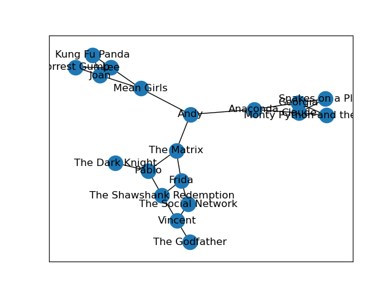
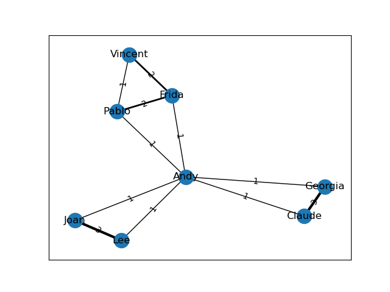

# 🎬 Employee Movie Graph Analysis 📊✨

[](https://www.python.org/)
[](LICENSE)
[]()

This project analyzes movie preferences among employees in a company and their interpersonal relationships.  
It demonstrates:
- How to create and manipulate bipartite graphs using NetworkX
- How to project bipartite graphs into employee-employee similarity graphs
- How to compute Pearson correlations between social relationships and shared interests

---

## 📂 Project Structure

```
.
├── data/
│   ├── Employee_Movie_Choices.txt
│   └── Employee_Relationships.txt
│
├── images/
│   ├── employee_movie_graph.png
│   └── projected_graph.png
│
├── graph_analysis.py
├── LICENSE
└── README.md
```

---

## ✨ Features

✅ **Bipartite Graph Construction**  
Builds a graph connecting employees to the movies they selected.

✅ **Node Attribute Labeling**  
Each node is labeled as `employee` or `movie`.

✅ **Weighted Projection**  
Projects the bipartite graph to show how many movies each pair of employees has in common.

✅ **Pearson Correlation Analysis**  
Calculates correlation between relationship scores and movie overlap.

✅ **Beautiful Visualizations**  
Graphs generated with Matplotlib.

---

## 🚀 How to Run

### 1️⃣ Install Dependencies

```bash
pip install networkx pandas numpy matplotlib
```

---

### 2️⃣ Run the Script

```bash
python graph_analysis.py
```

Or open `graph_analysis.py` in a Jupyter Notebook and run step by step.

---

## 🖼️ Sample Visualizations

### 🎥 Bipartite Employee-Movie Graph



---

### 🤝 Employee Projection Graph with Shared Movies



---

## 📈 Pearson Correlation Output

Running the script will print the correlation value:

```
Pearson correlation: 0.7884
```

---

## 🙋 Author

**Mukesh Thenraj**  
[GitHub Profile](https://github.com/Mukeshthenraj)

---

## 📝 License

This project is licensed under the MIT License.
